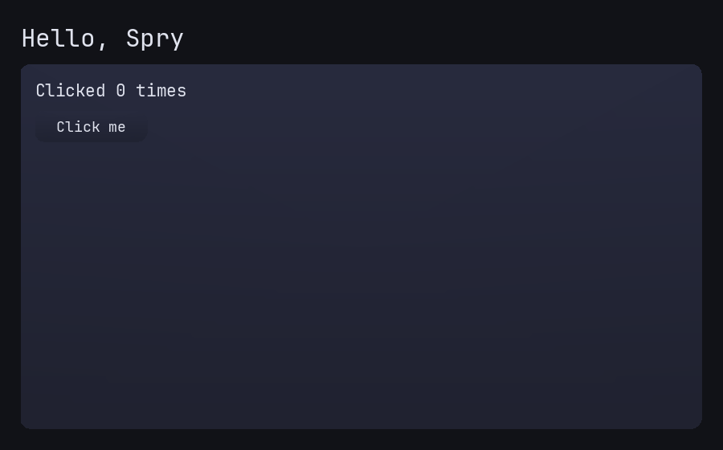
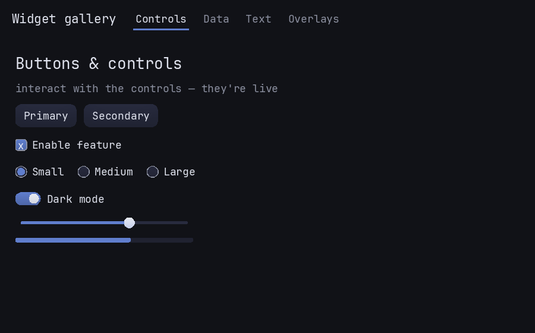

# Examples

Runnable programs that build against the public API (`<spry/spry.h>` + one renderer
backend). New to Spry? Read them in order — `hello` first. Each is a complete,
copy-a-starting-point program; the source below is transcluded straight from
[`examples/`](https://github.com/zimventures/spry/tree/main/examples), so it never
drifts.

## Try it live

The demo below is the **real Spry toolkit compiled to WebAssembly**, running in your
browser — not a video or a screenshot. Hover the cards to see the spring animations,
and **click** (or press **T**) to crossfade between themes. It's the [`demo.cpp`](#demo)
UI adapted for the browser as the `theming` scene in
[`examples/web/scenes.h`](https://github.com/zimventures/spry/blob/main/examples/web/scenes.h)
(driven by [`web_demos.cpp`](https://github.com/zimventures/spry/blob/main/examples/web/web_demos.cpp)),
on the `SdlRenderer` backend (which SDL renders via WebGL), built with Emscripten.

<iframe class="spry-demo" src="../assets/wasm/demo.html?scene=theming"
        title="Spry live WebAssembly demo — layout & theming" loading="lazy"
        sandbox="allow-scripts allow-same-origin"></iframe>

| Example | Target | Backend | Start here? |
|---|---|---|---|
| [hello.cpp](#hello) | `spry_hello` | SDL | **Yes** — the minimal app |
| [demo.cpp](#demo) | `spry_demo` | SDL | Layout + theming |
| [gl_demo.cpp](#gl_demo) | `spry_gl_demo` | OpenGL | The full gallery |

## Building & running

All three build with Spry (`SPRY_BUILD_DEMO` is on by default):

```sh
cmake -B build -G Ninja
cmake --build build
./build/spry_hello
./build/spry_demo      # loads the .theme files copied next to the exe
./build/spry_gl_demo
```

## hello.cpp {#hello}

The minimal one-screen app in ~100 lines: create an SDL window + `SdlRenderer`, build
a retained `Box` tree with a clickable `Button` that mutates a `Label`, and drive it
with the `pumpEvent` / `frame` loop. This is the reference for the public-API contract
— **start here**, and follow the [Getting started](../getting-started.md) tutorial,
which builds it up one piece at a time.

<iframe class="spry-demo" src="../assets/wasm/demo.html?scene=hello"
        title="Spry live demo — the hello.cpp app: a heading, a panel, and a counter button"
        loading="lazy" sandbox="allow-scripts allow-same-origin"></iframe>
<noscript></noscript>

```sh
cmake --build build --target spry_hello && ./build/spry_hello
```

??? example "Source — examples/hello.cpp"

    ```cpp
    --8<-- "examples/hello.cpp"
    ```

## demo.cpp {#demo}

Layout and theming on the SDL backend: flex `Box` rows/columns, `Label` roles, `Card`s,
`Panel`s, and **hot-swappable themes** loaded from `.theme` files — press **T** to
crossfade between them. The animated theme transition (below) is its signature; see the
[Theming guide](../guides/theming.md) and [theme-token reference](../guides/theme-tokens.md).

<iframe class="spry-demo" src="../assets/wasm/demo.html?scene=theming"
        title="Spry live demo — demo.cpp: layout, cards, and hot-swappable themes (click or press T)"
        loading="lazy" sandbox="allow-scripts allow-same-origin"></iframe>
<noscript></noscript>

```sh
cmake --build build --target spry_demo && ./build/spry_demo
```

??? example "Source — examples/demo.cpp"

    ```cpp
    --8<-- "examples/demo.cpp"
    ```

## gl_demo.cpp {#gl_demo}

The full interactive gallery on the OpenGL backend: `TabBar`, `Table`, `TreeView`,
`ListView`, text input, and overlay-spawning buttons — plus the complete host wiring
(SDL→`InputEvent` pump, text input/IME, clipboard, HiDPI scaling, animated theme swaps).
It's the reference for embedding Spry in a GL host. The controls and data widgets it
exercises are catalogued in [Widgets](../widgets/index.md).

The live gallery below shows the same widget set across tabs, rendered here through the
`SdlRenderer` → WebGL path (the `gl_demo.cpp` source targets an OpenGL host):

<iframe class="spry-demo" src="../assets/wasm/demo.html?scene=gallery"
        title="Spry live demo — the full widget gallery: controls, data, text, and overlays across tabs"
        loading="lazy" sandbox="allow-scripts allow-same-origin"></iframe>
<noscript></noscript>

```sh
cmake --build build --target spry_gl_demo && ./build/spry_gl_demo
```

??? example "Source — examples/gl_demo.cpp"

    ```cpp
    --8<-- "examples/gl_demo.cpp"
    ```

## Theme files

`demo.cpp` and `gl_demo.cpp` load themes from
[`examples/themes/`](https://github.com/zimventures/spry/tree/main/examples/themes) —
the flat `.theme` format documented in the
[theme-token reference](../guides/theme-tokens.md). Two ship: **midnight** (cool) and
**ember** (warm, with a rounder `radius` so you can see metric tokens animate too).

=== "midnight.theme"

    ```
    --8<-- "examples/themes/midnight.theme"
    ```

=== "ember.theme"

    ```
    --8<-- "examples/themes/ember.theme"
    ```

---

Next: the [Getting started](../getting-started.md) tutorial, the concept
[Guides](../guides/index.md), or the [API reference](../api/index.html).
