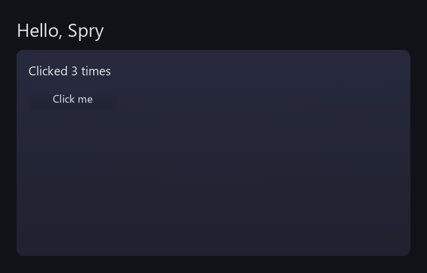

# Getting started with Spry

A hands-on tutorial for the Spry UI toolkit. It builds up from a blank window to an
interactive, themed, animated app, teaching the public API one piece at a time.

- For the **reference** view of the API — every module, what's stable vs experimental, the
  stability contract — see the [public-API ADR](adr/0001-spry-public-api.md) and the generated
  [C++ API reference](api/index.html).
- For runnable code, see the [examples gallery](examples/index.md) (sources under
  [`examples/`](https://github.com/zimventures/spry/tree/main/examples)). This guide references
  those files rather than repeating them.

Spry is a **retained-mode** toolkit: you build a persistent tree of `Widget` objects once, then
drive it each frame. The host owns the window, the GPU, and the event loop; Spry owns layout,
drawing, theming, and animation. Everything lives in `namespace spry`.

---

## 1. Add Spry to your build

Spry is a CMake target named `spry`:

```cmake
add_subdirectory(libs/spry)            # or vendor it however you like
target_link_libraries(myapp PRIVATE spry)
```

Its include dir and its dependencies (SDL3, FreeType, HarfBuzz, OpenGL) propagate to you
automatically. If your project already provides `SDL3::SDL3` / `freetype` / `harfbuzz` targets,
Spry reuses them; otherwise it fetches pinned versions.

Include the umbrella header plus **one** renderer backend:

```cpp
#include <spry/spry.h>          // Context, Widget, Box, widgets, Theme, anim, input
#include <spry/sdl_renderer.h>  // one renderer backend — OR <spry/gl_renderer.h>
#include <spry/sdl_host.h>      // optional SDL event pump (used in §2 and §7)
using namespace spry;
```

Pick `SdlRenderer` for a simple standalone app (it wraps an `SDL_Renderer`), or `GlRenderer` to
embed in a host that already owns an OpenGL context.

---

## 2. The smallest app

The full minimal program is
[`examples/hello.cpp`](https://github.com/zimventures/spry/blob/main/examples/hello.cpp)
(~90 lines). Its shape:

```cpp
SdlRenderer ren(sdl);          // wrap a host-owned SDL_Renderer*
ren.loadFont("…/DejaVuSansMono.ttf");

Context ctx;
ctx.setRoot(buildTree());      // a std::unique_ptr<Widget>
ctx.setThemeImmediate(Theme::builtinDark());

while (running) {
    SDL_Event e;
    while (SDL_PollEvent(&e)) pumpEvent(ctx, e, win);   // translate + dispatch input
    ren.beginFrame(ctx.displayedTheme().color("background"));
    ctx.frame(ren, dt, mouseX, mouseY);                 // layout → hover → update → draw
    ren.endFrame();
}
```

The two calls that matter are **`pumpEvent`** (translate one SDL event into a `spry::InputEvent`
and dispatch it — from the optional `<spry/sdl_host.h>`; §7 shows the manual path too) and
**`frame`** (run one frame). Everything else is host boilerplate.



---

## 3. Building a widget tree

Widgets are plain objects you compose into a tree. `emplace<T>(args…)` constructs a child in
place and hands back a raw pointer so you can keep configuring it:

```cpp
auto root = std::make_unique<Box>();   // Box = flex container
root->axis = Axis::Column;
root->padding = Edges(24);
root->spacing = 16;

root->emplace<Label>("Hello, Spry", 2.4f);

auto* row = root->emplace<Box>();
row->axis = Axis::Row;
row->spacing = 12;
row->emplace<Button>("OK", [] { /* onClick */ });
row->emplace<Button>("Cancel", [] {});
```

Layout is flexbox-like. Each widget carries hints the parent `Box` reads:

- `prefW` / `prefH` — preferred size (`-1` = auto / content-sized).
- `grow` — flex weight along the parent's main axis (a `grow=1` child eats leftover space).
- `margin`, and on `Box`: `padding`, `spacing`, `cross` (`Align::Start/Center/End/Stretch`).

Use `WrapBox` instead of `Box` for left-to-right flow that wraps. Return the root as a
`std::unique_ptr<Widget>` and hand it to `ctx.setRoot(...)`.

---

## 4. Built-in widgets

All from `<spry/spry.h>`:

- **Text & surfaces:** `Label`, `Paragraph` (word-wrap), `Panel`, `Card`, `ProgressBar`, `Image`.
- **Controls:** `Button`, `Checkbox`, `RadioButton`, `Toggle`, `Slider`, `Combo`.
- **Text input:** `TextField` (single line), `TextArea` (multi-line). Both take `onChange`
  callbacks; `TextField` also has `onSubmit`. The headless `EditBuffer` behind them is usable
  on its own if you need an editing model without a widget.
- **Color:** `ColorField` (a swatch that opens a picker), `ColorPickerPad`.
- **Data containers:** `ListView`, `Table` (sortable columns), `TreeView`, `ScrollView`,
  `TabBar` — all virtualized where it matters.

Most controls follow the same pattern: public fields for state, a `std::function` callback for
changes. For example:

```cpp
auto* slider = box->emplace<Slider>(0.0f, 100.0f, 50.0f);
slider->onChange = [](float v) { /* … */ };

auto* toggle = box->emplace<Toggle>();
toggle->label = "Dark mode";
toggle->onChange = [](bool on) { /* … */ };
```

To update a widget, mutate its public fields (e.g. `label->text = "…"`) — the next `frame()`
re-measures and redraws. See
[`examples/gl_demo.cpp`](https://github.com/zimventures/spry/blob/main/examples/gl_demo.cpp) for a
gallery that exercises nearly every widget.

<iframe class="spry-demo" src="../assets/wasm/demo.html?scene=controls"
        title="Spry live demo — an interactive control gallery"
        loading="lazy" sandbox="allow-scripts allow-same-origin"></iframe>
<noscript></noscript>

---

## 5. Theming

A `Theme` is a bag of named tokens — colors and float metrics — that widgets read by role:

```cpp
Theme t = Theme::builtinDark();          // always works, no file needed
Theme::loadFromFile("midnight.theme", t); // optional overrides (flat text format)
ctx.setThemeImmediate(t);                 // or ctx.setTheme(t) for an animated crossfade
```

The core token vocabulary widgets expect is defined in
[`<spry/theme_tokens.h>`](https://github.com/zimventures/spry/blob/main/include/spry/theme_tokens.h)
— colors `background`, `surface`, `surfaceAlt`, `accent`, `accentText`, `text`, `textDim`,
`scrim`, and metric `radius`, each with a `spry::tokens::` constant and a doc comment. Read them
with `theme.color(tokens::Accent)` / `theme.metric(tokens::Radius)`; a missing token falls back to
the value you pass. You can build a `Theme` entirely in code, and `theme.missingCoreTokens()`
reports any core tokens you left out (handy for catching typos after loading a theme file). Hosts
may define extra custom tokens too.

`ctx.setTheme(newTheme)` crossfades every token over a few frames — theme switching is animated
for free.

<iframe class="spry-demo" src="../assets/wasm/demo.html?scene=theming"
        title="Spry live demo — hot-swappable themes (click or press T to crossfade)"
        loading="lazy" sandbox="allow-scripts allow-same-origin"></iframe>
<noscript></noscript>

---

## 6. Animation

Animation is a first-class primitive, not a bolt-on. Widgets own their own animation state; the
building block is `Spring`, a damped spring:

```cpp
Spring lift;              // value/vel/target, tunable stiffness & damping
lift.target = hovered ? 6.0f : 0.0f;
lift.step(dt);            // call each frame
float y = lift.value;     // eases toward target, no easing bookkeeping
```

There are also `easeOutCubic` / `easeOutBack` for one-shot tweens. `Card` and `Toggle` use
`Spring` internally — a good read if you're building an animated widget. (The theme crossfade is
a time-based `easeOutCubic` tween instead of a spring.)

<iframe class="spry-demo" src="../assets/wasm/demo.html?scene=animation"
        title="Spry live demo — springs and easing curves"
        loading="lazy" sandbox="allow-scripts allow-same-origin"></iframe>
<noscript></noscript>

---

## 7. Input & interactivity

Spry is platform-agnostic: you translate your platform's events into `spry::InputEvent` and call
`ctx.handleEvent`. The manual path is just a struct plus a call:

```cpp
InputEvent ev;
ev.type = InputEvent::MouseDown;
ev.x = px; ev.y = py; ev.button = 0;   // 0=left 1=right 2=middle
ctx.handleEvent(ev);
```

`Context` routes events to the hovered/pressed/focused widget, handles Tab focus traversal, and
fires `onClick` when a press and release land on the same widget.

If your host is SDL3, the optional
**[`<spry/sdl_host.h>`](https://github.com/zimventures/spry/blob/main/include/spry/sdl_host.h)**
header does all of this for you — include it (it's opt-in, not in the umbrella header) and the
loop becomes:

```cpp
installSdlHost(ctx, win);              // once: SDL clipboard + text-input/IME handlers
while (running) {
    SDL_Event e;
    while (SDL_PollEvent(&e)) {
        if (e.type == SDL_EVENT_QUIT) running = false; // app lifecycle stays yours
        pumpEvent(ctx, e, win);        // translate + dispatch the input event
    }
    float mx, my;
    SDL_GetMouseState(&mx, &my);
    mouseToSpry(win, mx, my, mx, my);  // window points -> Spry pixels (no-op at 1x)
    ren.beginFrame(ctx.displayedTheme().color("background"));
    ctx.frame(ren, dt, mx, my);        // frame()'s mouse must match pumpEvent's pixel space
    ren.endFrame();
}
```

`pumpEvent` handles keycode translation, HiDPI mouse scaling, Cmd→Ctrl, and IME. Note the
per-frame mouse passed to `ctx.frame()` (used for hover/drag) must be in the **same** Spry pixel
space — scale `SDL_GetMouseState` through `mouseToSpry` too, or on HiDPI the two drift apart. A
non-SDL host translates its platform events into `InputEvent` and calls `ctx.handleEvent` the
same way. The full pump — keyboard, wheel, text, and IME — is in
[`examples/gl_demo.cpp`](https://github.com/zimventures/spry/blob/main/examples/gl_demo.cpp).

Each frame, read `ctx.cursor()` and apply the platform cursor (Spry asks for resize cursors over
draggable dividers, etc.).

---

## 8. Overlays: menus, modals, tooltips, toasts

Transient layers live above the tree and manage their own open/close animation. Push one onto the
`Context`:

```cpp
auto menu = std::make_unique<Menu>();
menu->anchorX = x; menu->anchorY = y;
menu->addItem("Rename", [] { /* … */ });
menu->addItem("Delete", [] { /* … */ });
ctx.addOverlay(std::move(menu));
```

`Modal` (centered, dims the background), `Tooltip`, and `Toast` (stacked notifications) work the
same way. A widget's `onClick` can spawn an overlay via `Context::current()->addOverlay(...)` —
that's how `Combo` opens its dropdown. Hover tooltips are automatic: set `widget->tooltip = "…"`
and `Context` shows it after a hover delay.

<iframe class="spry-demo" src="../assets/wasm/demo.html?scene=overlays"
        title="Spry live demo — menus, modals, tooltips, and toasts"
        loading="lazy" sandbox="allow-scripts allow-same-origin"></iframe>
<noscript></noscript>

---

## Next steps

- **Go deeper** — the concept [Guides](guides/index.md): [layout](guides/layout.md),
  [theming](guides/theming.md), [animation](guides/animation.md), [text](guides/text.md),
  [input](guides/input.md), and [renderer backends](guides/renderer-backends.md).
- **Browse the toolkit** — the [widget catalog](widgets/index.md).
- **Read the code** — the [examples gallery](examples/index.md):
  [`hello.cpp`](https://github.com/zimventures/spry/blob/main/examples/hello.cpp) (the minimal app
  from §2), [`demo.cpp`](https://github.com/zimventures/spry/blob/main/examples/demo.cpp) (layout +
  theming on the SDL backend), and
  [`gl_demo.cpp`](https://github.com/zimventures/spry/blob/main/examples/gl_demo.cpp) (the full
  interactive gallery on the GL backend).
- **Reference** — the [C++ API reference](api/index.html) and the
  [public-API ADR](adr/0001-spry-public-api.md) (design rationale + stability contract).
