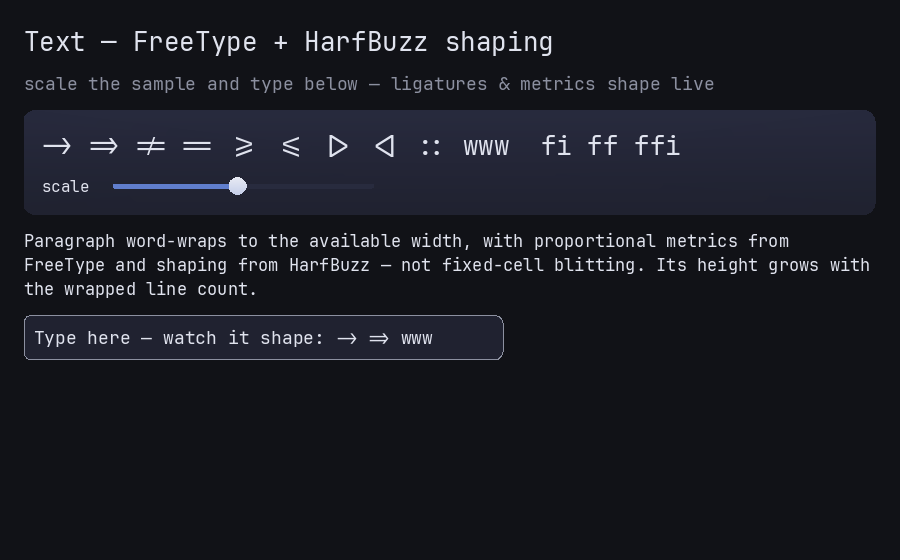

# Text

Spry renders real shaped text, not fixed-cell blitting. Glyph rasterization and
metrics come from **FreeType**; shaping (ligatures, kerning, complex scripts) comes
from **HarfBuzz**. Both live behind the [renderer](renderer-backends.md), so widgets
just ask the `Renderer` to draw or measure a string.

## Loading a font

The renderer owns fonts. Load one before you draw (a font is required for real text;
without it, `SdlRenderer` falls back to SDL's debug font):

```cpp
SdlRenderer ren(sdl);
ren.loadFont("/usr/share/fonts/truetype/dejavu/DejaVuSansMono.ttf");
```

`examples/hello.cpp` tries a small list of platform font paths and uses the first
that loads.

## Drawing and measuring

Widgets emit text through two `Renderer` calls:

- `text(x, y, scale, color, utf8)` — draw a string.
- `measureText(scale, utf8) → Size` — measure it (used by `Label::measure`, layout,
  and caret positioning).

`scale` is relative to the base text size. The header exposes the metric helpers the
layout uses — `kTextBasePx` (the base pixel size) and `textLineH(scale)` /
`textCellW(scale)` for line height and advance — so custom widgets can lay text out
consistently with the built-ins.

You rarely call these directly: the text widgets do it for you.

## Text widgets

- **`Label`** — a single line, sized from its content.
- **`Paragraph`** — word-wrapped multi-line text.
- **`TextField`** (single-line) and **`TextArea`** (multi-line) for editing, both
  backed by the headless, unit-tested **`EditBuffer`** (`text_edit.h`) — which you
  can also use on its own if you need an editing model without a widget.

See [Input, focus & keyboard nav](input.md) for how the editing widgets receive
keystrokes, committed text, and IME composition.

<iframe class="spry-demo" src="../assets/wasm/demo.html?scene=text"
        title="Spry live demo — FreeType + HarfBuzz text shaping, ligatures, and wrapping"
        loading="lazy" sandbox="allow-scripts allow-same-origin"></iframe>
<noscript></noscript>

## Stability

The text path — the `Renderer` text methods, the metric helpers, and the text/edit
widgets — is **stable public surface**. `EditBuffer` is public and unit-tested.

## Related

- [Renderer backends](renderer-backends.md) — where FreeType/HarfBuzz live.
- [Built-in widgets](../widgets/index.md) — `Label`, `Paragraph`, `TextField`,
  `TextArea`.
- [Getting started §4](../getting-started.md#4-built-in-widgets).
