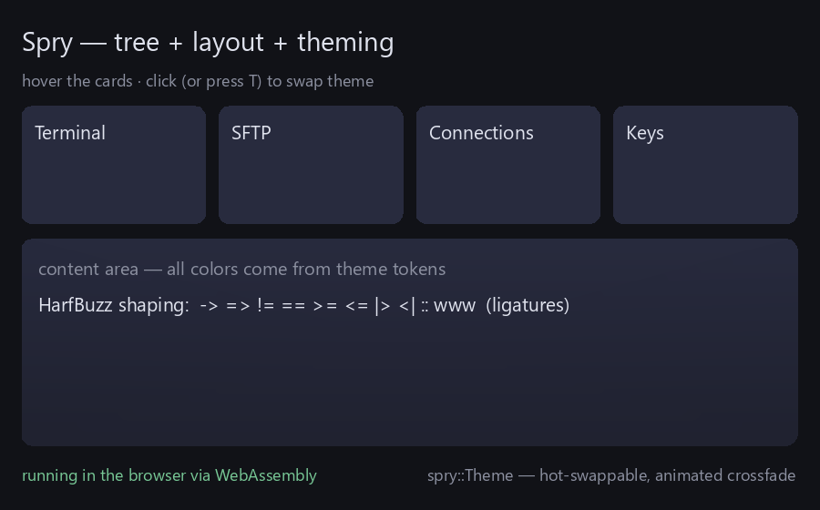

# Theme tokens

This is the authoritative reference for Spry's **core theme tokens** — the named
colors and metrics that built-in widgets read from the active `Theme` — plus a
guide to **writing your own theme**. For the concepts (how themes are applied and
animated), see [Theming & tokens](theming.md).

The core vocabulary is defined once, in
[`theme_tokens.h`](https://github.com/zimventures/spry/blob/main/include/spry/theme_tokens.h),
as `spry::tokens::` constants. Widgets reference the constants, not string
literals, so the vocabulary has a single documented home.

## The core token vocabulary

Every value below is the built-in dark theme's (`Theme::builtinDark()`) — the
canonical reference. A theme need not define every token: a widget reading a
missing token falls back to the value it passes at the call site, so a partial
theme degrades quietly rather than crashing. `Theme::missingCoreTokens()` reports
which core tokens a loaded theme left out.

### Colors

| Token (`tokens::`) | Key | Role & consumers | `builtinDark` |
|---|---|---|---|
| `Background` | `background` | Window background; the host reads it for the renderer's `beginFrame()` clear color. | <span style="display:inline-block;width:0.9em;height:0.9em;background:#111217;border:1px solid #8888;border-radius:2px;vertical-align:middle"></span> `#111217` |
| `Surface` | `surface` | Primary panel / control surface fill — `Panel`, `Card`, buttons. | <span style="display:inline-block;width:0.9em;height:0.9em;background:#282B3E;border:1px solid #8888;border-radius:2px;vertical-align:middle"></span> `#282B3E` |
| `SurfaceAlt` | `surfaceAlt` | Recessed / secondary surface — slider & scrollbar tracks, alternating rows, insets. | <span style="display:inline-block;width:0.9em;height:0.9em;background:#202230;border:1px solid #8888;border-radius:2px;vertical-align:middle"></span> `#202230` |
| `Accent` | `accent` | Accent / brand color — selection, focus rings, active controls, sliders, toggles. | <span style="display:inline-block;width:0.9em;height:0.9em;background:#607ECD;border:1px solid #8888;border-radius:2px;vertical-align:middle"></span> `#607ECD` |
| `AccentText` | `accentText` | Text drawn on top of an accent fill (e.g. a selected tab's label). | <span style="display:inline-block;width:0.9em;height:0.9em;background:#EBEEF8;border:1px solid #8888;border-radius:2px;vertical-align:middle"></span> `#EBEEF8` |
| `Text` | `text` | Primary text color. | <span style="display:inline-block;width:0.9em;height:0.9em;background:#E0E3EE;border:1px solid #8888;border-radius:2px;vertical-align:middle"></span> `#E0E3EE` |
| `TextDim` | `textDim` | Dimmed / secondary text, placeholders, inactive borders. | <span style="display:inline-block;width:0.9em;height:0.9em;background:#8C90A0;border:1px solid #8888;border-radius:2px;vertical-align:middle"></span> `#8C90A0` |
| `Scrim` | `scrim` | Drawn behind a `Modal` to dim the content beneath it — uses the color's **alpha**. | <span style="display:inline-block;width:0.9em;height:0.9em;background:#08090E;border:1px solid #8888;border-radius:2px;vertical-align:middle"></span> `#08090E` @ α`170` |

### Metrics

| Token (`tokens::`) | Key | Role & consumers | `builtinDark` |
|---|---|---|---|
| `Radius` | `radius` | Corner radius for panels and controls, in logical px. | `12` |

Read tokens with the constants:

```cpp
Color surface = theme.color(tokens::Surface);
float radius  = theme.metric(tokens::Radius, 6.0f); // 6.0 if the theme omits it
```

!!! note "Custom tokens"
    Hosts may define **any number of extra tokens** beyond the core set — the
    built-in dark theme, for instance, also sets a non-core `pad` metric (`24`)
    that the examples use for spacing. Only the tokens above are validated by
    `missingCoreTokens()`.

## Writing a theme

A `.theme` file is a minimal flat text format (no JSON dependency — this keeps
Spry's [decoupling contract](../adr/0001-spry-public-api.md) intact). Two line
kinds, plus comments:

```
color  <key>  r g b [a]     # channels are 0–255; alpha optional (defaults to 255)
metric <key>  <value>       # a float
# lines starting with (or containing) # are comments
```

Anything from a `#` to end-of-line is ignored, so trailing comments work. Unknown
keys are accepted and stored — that's how you add custom tokens. A full example
([`examples/themes/midnight.theme`](https://github.com/zimventures/spry/blob/main/examples/themes/midnight.theme)):

```
# midnight — cool dark theme
color background  17 18 23
color surface     40 43 62
color surfaceAlt  32 34 48
color text        224 227 238
color textDim     140 144 160
color accent      96 126 205
color accentText  235 238 248
metric radius     12
metric pad        24
```

You never *have* to use a file — a host can build a `Theme` entirely in code by
populating its `colors` / `metrics` maps (or starting from `builtinDark()` and
overriding a few tokens).

## Loading & hot-swapping

Load a file over a base theme, then apply it. Start from `builtinDark()` so you
always have a complete theme even if the file is missing:

```cpp
Theme t = Theme::builtinDark();
if (!Theme::loadFromFile("midnight.theme", t))   // false if missing/unreadable
    /* t keeps the built-in values */;

ctx.setThemeImmediate(t);   // initial theme: no transition
// …later, at runtime:
ctx.setTheme(t);            // animated crossfade from the current theme
```

`loadFromFile` returns `false` and leaves the passed-in theme untouched if the
file can't be read, so the `builtinDark()` base is your guaranteed fallback.

## Animated transitions

`setTheme` doesn't snap. `Context::frame` advances a short transition and computes
the displayed theme as an `easeOutCubic` tween over per-token `lerp` — each color
and metric eases from the outgoing value to the incoming one:

```cpp
// inside Context::frame (paraphrased):
trans_ = std::min(1.0f, trans_ + dt * 4.0f);
displayed_ = lerp(from_, to_, easeOutCubic(trans_));
```

Because metrics interpolate too, even the corner **`radius`** animates between
themes. Interpolation covers the tokens the **outgoing** theme defines; a token
present only in the incoming theme appears when the transition completes (in
practice both themes share the same core set). Always draw against
`ctx.displayedTheme()` in your frame loop — that's the currently-interpolated
theme.

## The example themes

Two ready-made themes ship under
[`examples/themes/`](https://github.com/zimventures/spry/tree/main/examples/themes),
loaded by `demo.cpp` / `gl_demo.cpp` (press **T** to crossfade):

- **[`midnight.theme`](https://github.com/zimventures/spry/blob/main/examples/themes/midnight.theme)**
  — a cool, blue-accented dark theme.
- **[`ember.theme`](https://github.com/zimventures/spry/blob/main/examples/themes/ember.theme)**
  — a warm, orange-accented theme with a rounder `radius` (`18`) specifically to
  show that **metric** tokens animate too, not just colors.

<iframe class="spry-demo" src="../assets/wasm/demo.html?scene=theming"
        title="Spry live demo — two token sets crossfading (click or press T)"
        loading="lazy" sandbox="allow-scripts allow-same-origin"></iframe>
<noscript></noscript>

## Stability

The token registry (`theme_tokens.h`, #321) is **stable public surface**; new core
tokens are additive. See the [public-API ADR](../adr/0001-spry-public-api.md) for
the full stability contract.

## Related

- [Theming & tokens](theming.md) — the concepts behind this reference.
- [Animation](animation.md) — the `easeOutCubic` tween that drives crossfades.
- [Getting started §5](../getting-started.md#5-theming).
