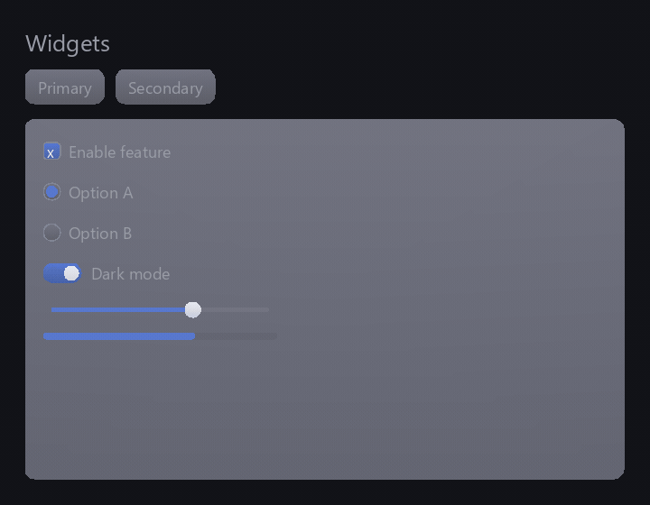

# Theming & tokens

A `spry::Theme` is a **data-driven token bag**: two maps, `colors` (name → `Color`)
and `metrics` (name → `float`), that widgets read by role rather than by hard-coded
literal. Because the whole look is data, you can restyle an app — or animate between
styles — without touching widget code.

## Reading and building a theme

Widgets read tokens through `color(key, fallback)` and `metric(key, fallback)`; a
missing token returns the fallback, so a partial theme still renders. You can build
a `Theme` entirely in code, start from the always-available `builtinDark()`, or
load overrides from a flat text file:

```cpp
Theme t = Theme::builtinDark();             // always works, no file needed
if (!Theme::loadFromFile("midnight.theme", t))
    /* file missing/unreadable — t keeps the built-in values */;
ctx.setThemeImmediate(t);                    // apply with no transition

// Reading a token (e.g. inside a custom widget's draw) — prefer the tokens:: constants:
Color accent = theme.color(tokens::Accent);
float radius = theme.metric(tokens::Radius, 6.0f); // 6.0 if the theme omits it
```

`loadFromFile` returns `false` if the file is missing or unreadable, leaving the
theme you passed untouched — so starting from `builtinDark()` guarantees a usable
theme either way.

The file format is deliberately minimal — `color <key> r g b [a]` (channels are
0–255, alpha optional) and `metric <key> <value>` lines, with `#` for comments and
no JSON dependency — which keeps Spry's
[decoupling contract](../adr/0001-spry-public-api.md) intact:

```
# midnight — cool dark theme
color background  17 18 23
color accent      96 126 205
metric radius     12
```

A host that already has its own config system can skip files and populate a
`Theme` programmatically.

## The token vocabulary

The core token names widgets expect are defined in `theme_tokens.h` as
`spry::tokens::` constants — colors `background`, `surface`, `surfaceAlt`, `accent`,
`accentText`, `text`, `textDim`, `scrim`, and the metric `radius`, each documented.
Widgets reference the constants (`theme.color(tokens::Accent)`), not raw strings, so
typos are caught at compile time. To validate a theme you loaded from a file,
`Theme::missingCoreTokens()` returns the core tokens it left out. Hosts may define
extra custom tokens beyond the core set.

!!! tip "Full token reference"
    The complete, per-token vocabulary — each name, its role, its consumers, and its
    `builtinDark` value — is the **[Theme tokens reference](theme-tokens.md)**, which
    also covers the `.theme` file format and how to write your own theme.

## Animated theme swaps

`ctx.setTheme(newTheme)` doesn't snap — it **crossfades the theme's tokens** over a
few frames, interpolating each color and metric toward its new value, so switching
themes (light ↔ dark, or a user-picked accent) animates for free. `setThemeImmediate`
is the no-transition version for the initial theme. Each token is `lerp`-interpolated
along an `easeOutCubic` tween (see [Animation](animation.md)).

Interpolation covers the tokens the **outgoing** theme defines; a token that exists
only in the incoming theme appears when the transition completes (in practice both
share the same [core token set](#the-token-vocabulary), so this rarely shows).

```cpp
ctx.setTheme(Theme::builtinDark());   // animated crossfade from the current theme
```

Inside the frame loop, always clear and draw against `ctx.displayedTheme()` (the
currently-interpolated theme), not the target — that's what makes the transition
visible.

## Colors

`spry::Color` is a plain RGBA8 struct (`uint8_t r, g, b, a`) with free-function
helpers: `lerp(a, b, t)` to blend, and `hsv(h, s, v)` / `toHsv(...)` to convert to
and from HSV. These back the [color picker](../widgets/index.md) widgets.



## Stability

Theming (`theme.h`, `color.h`, `theme_tokens.h`) is **stable public surface**. The
token registry landed with #321; new tokens are additive.

## Related

- [Animation](animation.md) — the `easeOutCubic` easing behind the crossfade.
- [Getting started §5](../getting-started.md#5-theming) — theming in tutorial form.
- Example: [`demo.cpp`](https://github.com/zimventures/spry/blob/main/examples/demo.cpp)
  hot-swaps `.theme` files (press **T**).
