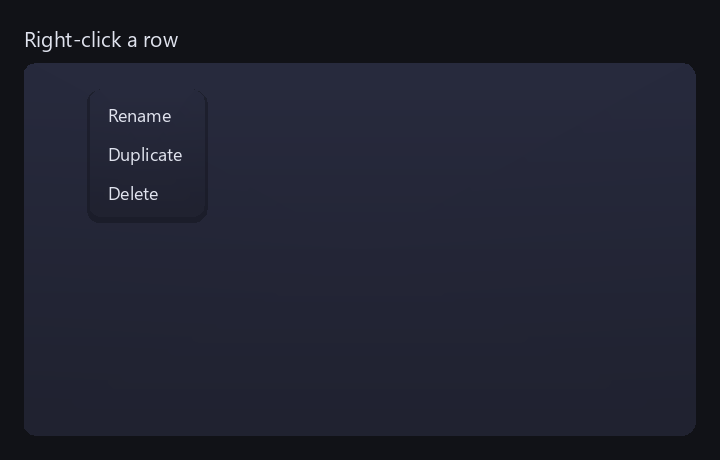
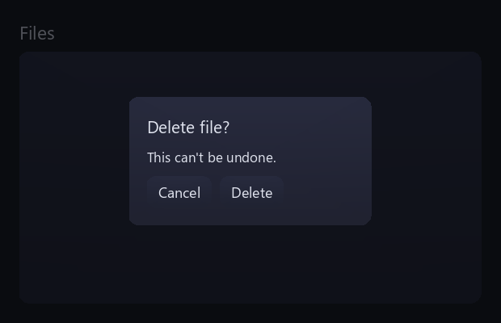

# Widget catalog

Every built-in widget, all from `<spry/spry.h>`. Most follow the same pattern:
**public fields for state, a `std::function` callback for changes**. Mutate a
widget's fields and the next `frame()` re-measures and redraws. Add them to the
tree with `parent->emplace<T>(args…)` (see [Layout](../guides/layout.md)).

<div class="grid cards" markdown>

- :material-format-text:{ .lg .middle } **[Text & surfaces](#text-surfaces)** — `Label`, `Paragraph`, `Panel`, `Card`, `ProgressBar`, `Image`
- :material-gesture-tap-button:{ .lg .middle } **[Buttons & controls](#buttons-controls)** — `Button`, `Checkbox`, `RadioButton`, `Toggle`, `Slider`
- :material-form-textbox:{ .lg .middle } **[Text input & selection](#text-input-selection)** — `TextField`, `TextArea`, `Combo`, `ColorField`
- :material-table:{ .lg .middle } **[Data containers](#data-containers)** — `ListView`, `Table`, `TreeView`, `ScrollView`, `TabBar`
- :material-layers-triple:{ .lg .middle } **[Overlays](#overlays)** — `Menu`, `Modal`, `Tooltip`, `Toast`

</div>

## Text & surfaces

<iframe class="spry-demo" src="../assets/wasm/demo.html?scene=text"
        title="Spry live demo — text & shaping: Label, Paragraph, ligatures, and wrapping"
        loading="lazy" sandbox="allow-scripts allow-same-origin"></iframe>

**`Label`** — a single line of text, sized to its content. `text`, `scale`.

```cpp
box->emplace<Label>("Hello, Spry", 2.4f);
```

**`Paragraph`** — word-wrapped multi-line text; honors explicit `\n`, and its height
grows with the wrapped line count. `text`, `scale`, `role` (the color token to draw
with).

```cpp
box->emplace<Paragraph>("A longer run of text that wraps to the available width.");
```

**`Panel`** — a rounded surface fill (the `surface`→`surfaceAlt` gradient). A
container: nest a `Box` inside for content. `radius` (−1 = the theme's `radius`).

**`Card`** — a labelled surface that **lifts and tints toward the accent on hover**
(a `Spring`). `label`.

```cpp
auto* card = box->emplace<Card>("Inbox");
```

**`ProgressBar`** — a determinate bar; `value` in `[0, 1]`, `thickness`.

```cpp
auto* bar = box->emplace<ProgressBar>();
bar->value = 0.6f;
```

**`Image`** — draws an RGBA image uploaded through the renderer. Point `pixels` at a
tightly-packed RGBA8 buffer with `srcW`/`srcH`, set the display size with `drawW`/`drawH`,
and give it a caller-owned `handle` (the upload is cached there across rebuilds). `tint`
modulates it. Shown as the gradient square above.

## Buttons & controls

<iframe class="spry-demo" src="../assets/wasm/demo.html?scene=controls"
        title="Spry live demo — buttons, checkboxes, radio buttons, a toggle, a slider, and a progress bar"
        loading="lazy" sandbox="allow-scripts allow-same-origin"></iframe>

**`Button`** — click, or Enter/Space when focused. Brightens on **hover**, darkens
on **press**, shows a **focus ring** for keyboard nav. Pass the callback to the
constructor or set `onClickCb`.

```cpp
box->emplace<Button>("Save", [] { /* onClick */ });
```

**`Checkbox`** — a labelled boolean. `checked`, `onChange(bool)`. Focusable.

```cpp
auto* c = box->emplace<Checkbox>("Enable feature", true);
c->onChange = [](bool on) { /* … */ };
```

**`RadioButton`** — one-of-many selection. `selected`, `onSelect()`. (Group them by
clearing the others in your `onSelect`.)

```cpp
box->emplace<RadioButton>("Option A", /*selected=*/true);
```

**`Toggle`** — an animated on/off switch (the knob is a `Spring`). `label`, `on`,
`onChange(bool)`.

```cpp
auto* t = box->emplace<Toggle>("Dark mode", true);
t->onChange = [](bool on) { /* … */ };
```

**`Slider`** — a draggable value; arrow keys nudge when focused. `minV`, `maxV`,
`value`, `step` (0 = continuous), `onChange(float)`.

```cpp
auto* s = box->emplace<Slider>(0.0f, 100.0f, 50.0f);
s->onChange = [](float v) { /* … */ };
```

## Text input & selection

<iframe class="spry-demo" src="../assets/wasm/demo.html?scene=textinput"
        title="Spry live demo — text input: TextField, a masked field, and a multi-line TextArea"
        loading="lazy" sandbox="allow-scripts allow-same-origin"></iframe>

**`TextField`** — single-line editing (selection, clipboard, undo). `placeholder`,
`onChange(text)`, `onSubmit()` (Enter). Construct with initial text.

```cpp
auto* f = box->emplace<TextField>("initial text");
f->placeholder = "Search…";
f->onChange = [](const std::string& s) { /* … */ };
```

**`TextArea`** — multi-line editing. `placeholder`, `onChange(text)`.

**`EditBuffer`** — the headless editing model behind both (`<spry/text_edit.h>`).
`text()`, `setText()` — usable on its own if you need editing logic without a widget.

**`Combo`** — a dropdown; opens a `Menu` overlay on click. `options`, `selected`,
`placeholder`, `onChange(index, value)`.

```cpp
auto* combo = box->emplace<Combo>(std::vector<std::string>{"Small", "Medium", "Large"}, 1);
combo->onChange = [](int i, const std::string& v) { /* … */ };
```

**`ColorField`** — a swatch (+ optional hex) that opens a `ColorPicker` overlay.
`value` (`Color`), `showHex`, `onChange(Color)`. The picker pad itself,
**`ColorPickerPad`** (SV square + hue strip), is usable standalone.

```cpp
auto* cf = box->emplace<ColorField>(Color{96, 126, 205});
cf->onChange = [](Color c) { /* … */ };
```

## Data containers

<iframe class="spry-demo" src="../assets/wasm/demo.html?scene=data"
        title="Spry live demo — data widgets: ListView, TreeView, a sortable Table, and a TabBar"
        loading="lazy" sandbox="allow-scripts allow-same-origin"></iframe>

All the list-like widgets share a virtualized base (`VirtualList`): they render only
visible rows, support keyboard navigation and `multiSelect`, and expose `selected` +
`onSelect(int)`.

**`ListView`** — a flat list of strings. `items`, `selected`, `onSelect(int)`.

```cpp
auto* list = box->emplace<ListView>();
list->items = {"Alpha", "Bravo", "Charlie"};
list->onSelect = [](int row) { /* … */ };
```

**`Table`** — a sortable, columnar table; clicking a header sorts by that column
(numeric or lexicographic) and toggles direction. `columns` (`Column{title, weight}`),
`rows` (row-major strings).

```cpp
auto* t = box->emplace<Table>();
t->columns = {{"Name", 2.0f}, {"Size", 1.0f}};
t->rows = {{"main.cpp", "4.2 KB"}, {"util.h", "1.1 KB"}};
```

**`TreeView`** — a hierarchical list; the disclosure triangle expands/collapses.
Build with `addRoot()` / `TreeNode::add()`, then `rebuild()`.

```cpp
auto* tree = box->emplace<TreeView>();
auto& src = tree->addRoot("src");
src.expanded = true;
src.add("main.cpp");
tree->rebuild();
```

**`TabBar`** — a horizontal tab strip with an animated active indicator. `tabs`,
`active`, `onChange(int)`.

```cpp
auto* tabs = box->emplace<TabBar>();
tabs->tabs = {"Files", "Search", "Git"};
tabs->onChange = [](int i) { /* … */ };
```

**`ScrollView`** — a fixed viewport that scrolls arbitrary content. `setContent(...)`;
size it with `prefW`/`prefH` or `grow`.

```cpp
auto* sv = box->emplace<ScrollView>();
sv->setContent(std::make_unique<Paragraph>(longText));
sv->grow = 1.0f;
```

## Overlays

Transient layers that draw above the tree and manage their own open/close animation.
Push one with `ctx.addOverlay(...)` (a widget's `onClick` can do this via
`Context::current()->addOverlay(...)`). See [Input](../guides/input.md#the-sdl-host-helper)
and [Getting started §8](../getting-started.md#8-overlays-menus-modals-tooltips-toasts).

<iframe class="spry-demo" src="../assets/wasm/demo.html?scene=overlays"
        title="Spry live demo — overlays: context menu, modal dialog, tooltip, and toasts"
        loading="lazy" sandbox="allow-scripts allow-same-origin"></iframe>

**`Menu`** — a popup list of `MenuItem`s at an anchor point. `anchorX`/`anchorY`,
`addItem(label, action)`.



```cpp
auto menu = std::make_unique<Menu>();
menu->anchorX = x; menu->anchorY = y;
menu->addItem("Rename", [] { /* … */ });
menu->addItem("Delete", [] { /* … */ });
ctx.addOverlay(std::move(menu));
```

**`Modal`** — centered content (set via `setContent(...)`) that dims the background
with the `scrim` token; dismiss on outside-click / Escape (configurable).



**`Tooltip`** — a small bubble shown at an anchor. Hover tooltips are automatic: set
any widget's `tooltip` field and `Context` shows one after a hover delay.

**`Toast`** — a stacked, auto-dismissing notification. `Toast(text, lifetime)`.

```cpp
ctx.addOverlay(std::make_unique<Toast>("Saved to disk"));
```

---

The full interactive gallery is
[`gl_demo.cpp`](https://github.com/zimventures/spry/blob/main/examples/gl_demo.cpp); every
type above is in the [API reference](../api/index.html).
